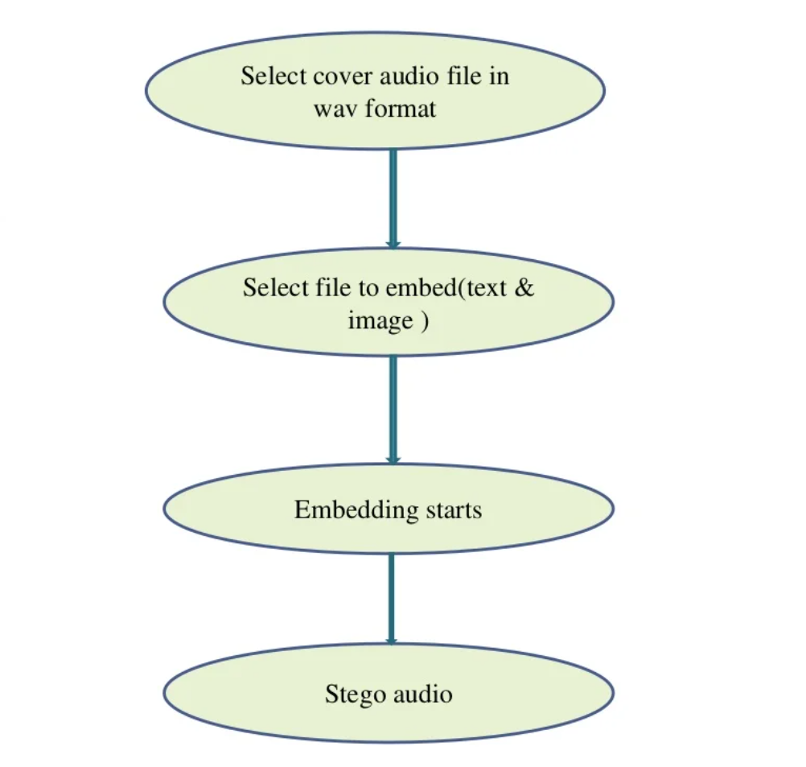
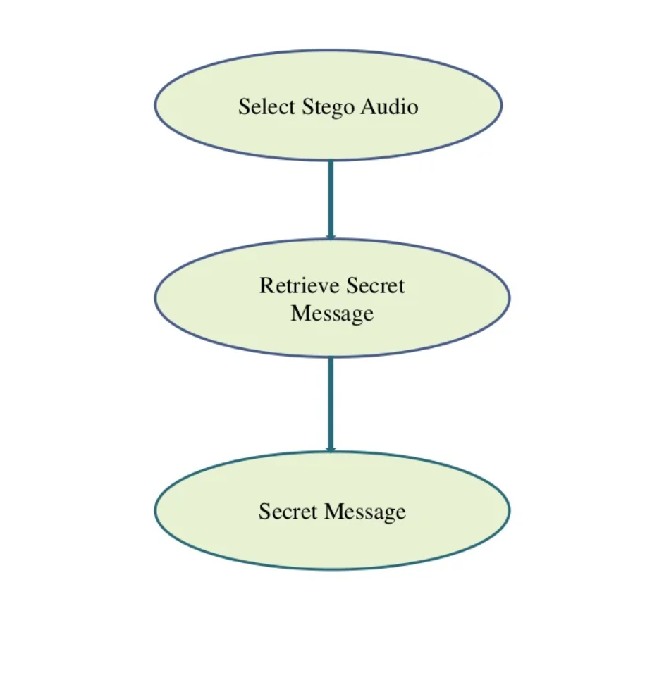

<h1 align="center">txt.wav - Audio Steganography</h1>

<h2><strong>About</h2></strong>

Steganography: The process of hiding the messages so that the presence of message itself is hidden, often by writing them in places where they may not be found.

Audio Steganography: Embedding secret digital sound is called audio steganography. Audio Steganography is presented where the bits of a secret message are embedded into the coefficients of a cover audio.

---

<h2><strong>Instructions to Run</h2></strong>

* Extract the repository to the folder of your choice

* This project has no dependencies 

* `sample_audio` folder contains the audio files that can be tested in the program

* Run `main.py`

* `new.wav` is the new audio file generated with the encoded message
 
* Decoded message can be found in `secret.txt`

---

<h2><strong>Features</h2></strong>

* Embedding Audio

* Retrieving Audio

---

<h2 align="center"><b>DEVELOPED BY</b></h2> 

